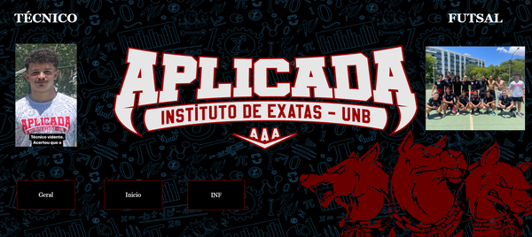
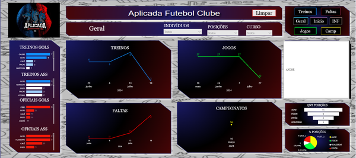
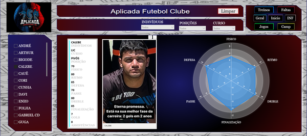
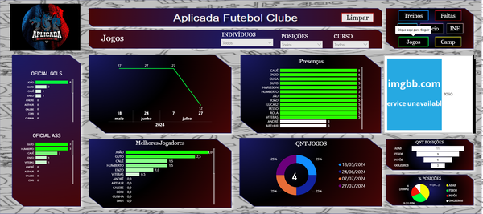
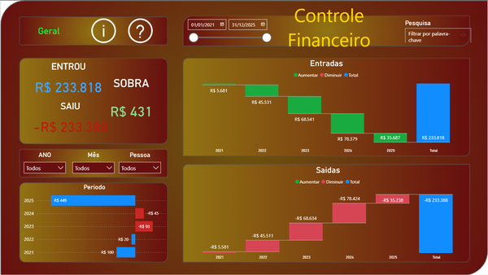
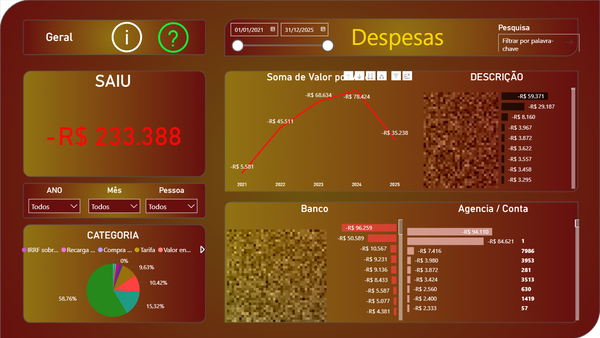

# 👨‍💻 Calebe Alves Ferreira

🎖️ Cabo do Exército Brasileiro  
🎓 Estudante de **Licenciatura em Computação** na **Universidade de Brasília (UnB)** — ingresso em 2022/2  
📊 Apaixonado por **Ciência de Dados, Visualização e Desenvolvimento de Software**

---

## 📚 Formação Acadêmica

- **Período:** Noturno  
- **Universidade de Brasília (UnB)**
  - Curso: Licenciatura em Computação
  - Semestre atual: 7º
  - Participação em projetos de visualização de dados com Power BI voltados para gestão acadêmica e esportiva

---

## 🤩 Habilidades em

<table align="center">
  <tr>
    <td align="center">
       
      <b>Python</b>
    </td>
    <td align="center">
       
      <b>C++</b>
    </td>
    <td align="center">
       
      <b>GitHub</b>
    </td>
  </tr>
</table>

---

## 🎯 Interesses

- Algoritmos e Estruturas de Dados  
- Programação Orientada a Objetos  
- Visualização de Dados  
- Integração de Power BI com Python
- **Aprender Java e desenvolver jogos digitais**

---

## 🏆 Estatísticas do GitHub

  

---

## 🧾 Certificados

> *Certificados em andamento ou concluídos:*

- 📜 **Fundamentos de Power BI** — Microsoft Learn  
- 📜 **Python para Análise de Dados** — Curso em Vídeo  
- 📜 **Introdução à Ciência de Dados** — DataCamp  
- 📜 **Excel Avançado para Negócios** — Udemy  
- 📜 **Lógica de Programação e Algoritmos** — DIO

---

## 🌍 Idiomas

- 🇧🇷 Português (nativo)  
- 🇪🇸 Espanhol (intermediário)  
- 🇺🇸 Inglês (iniciante)

---

## 🎯 Metas para 2025

- [ ] Aprofundar estudos em C++ e Python  
- [ ] Integrar Power BI com Python para análises mais completas  
- [ ] Criar e publicar projetos de software open source  
- [ ] Melhorar fluência em Inglês Técnico

---

## 💼 Experiência Profissional

- **Período:** Integral  

- **Cabo do Exército Brasileiro**  
  - Atuação administrativa e operacional  
  - Desenvolvimento de disciplina, liderança e resiliência  
  - Aplicação de dashboards para controle de materiais e usuários em sistemas internos  
  - Desenvolvimento de painéis interativos com Power BI para gestão de processos internos, incluindo:

    <ul>
      <li>📊 <b>Mnitoramento de contas de e-mail</b> 
      <li>📊 <b>Monitoramento de usuários em sistema</b> 
      <li>📊 <b>Organização e controle de material de carga</b> 
    </ul>

---

## 📊 Projetos com Power BI

> Painéis desenvolvidos para fins acadêmicos, pessoais e esportivos, com foco em análise de dados, visualização interativa e tomada de decisão.

---

### 🏟️ Aplicada FC — Visão Geral e Gestão Esportiva

> Painel institucional do Aplicada FC, com identidade visual do Instituto de Exatas - UnB. Apresenta técnico, equipe de futsal e estrutura organizacional.

---

### 📈 Desempenho Técnico e Estatísticas do Clube

> Dashboard interativo com filtros por posição, curso e jogador. Exibe dados de treinos, jogos, faltas, campeonatos, gols e assistências. Inclui gráficos de linha e barras para análise temporal e comparativa.

---

### 🧍 Perfis Individuais — Jogadores

> Perfis técnicos dos jogadores Calebe e Cauê, com gráficos radar, atributos físicos e técnicos, histórico de desempenho e filtros por posição e curso.

---

### 🏅 Ranking, Presenças e Projeções

> Painel com ranking dos melhores jogadores, presença em jogos, distribuição de projetos e projeções por curso e posição.

---

### 💰 Controle Financeiro Pessoal

> Painel desenvolvido para controle de entradas e saídas, planejamento financeiro e acompanhamento de metas pessoais.

---

### 📉 Painel de Despesas Detalhadas

> Dashboard com filtros por mês, categoria, banco e agência. Visualiza gastos totais e distribuição por tipo de despesa.

---

## 📫 Contato

- 🌐 [Instagram](https://www.instagram.com/calebeaf02/)  
- 💼 LinkedIn *(em construção)*  
- 📧 Email *(opcional)*

---

✨ Sempre aprendendo e evoluindo! 🚀
